<div align="center">
  
</div>

<div align="center">
  
</div>

<div align="center">
  
  
  
</div>

<br/>

<div align="center">
  <a href="mailto:awaneesh@gmail.com">
    
  </a>
  <a href="https://linkedin.com/in/awaneesh959891">
    
  </a>
  <a href="https://twitter.com/awaneesh959891">
    
  </a>
</div>

## 🎯 About Me

<table>
<tr>
<td width="50%">

```csharp
namespace Developer.Profile
{
    public class Awaneesh : IDeveloper
    {
        public string Name => "Awaneesh Vikram Singh";
        public string Role => ".NET Software Engineer";
        public string Location => "🌍 India";
        public int YearsOfExperience => DateTime.Now.Year - 2020;
        
        public string[] TechStack => new[]
        {
            "C# (.NET Core/Framework)",
            "ASP.NET Core & Web API",
            "Entity Framework Core",
            "SQL Server, PostgreSQL",
            "React, Angular, Blazor",
            "Azure Cloud Services",
            "Docker & Kubernetes"
        };
        
        public string CurrentMission => 
            "Building scalable, maintainable enterprise solutions";
            
        public void Introduction()
        {
            Console.WriteLine(@"
            🚀 Passionate about clean code architecture
            🎯 Focused on performance optimization
            🌱 Always learning new technologies
            🤝 Open to collaboration opportunities
            ");
        }
    }
}
```

</td>
<td width="50%">

### 🎯 **Quick Facts**

```yaml
name: Awaneesh Vikram Singh
located_in: India
current_job: .NET Developer
education: 
  - "Bachelor's in Computer Science"
  - "Microsoft Certified Developer"

fields_of_interests:
  - "Enterprise Application Development"
  - "Microservices Architecture"
  - "Cloud Computing (Azure)"
  - "DevOps & CI/CD"
  - "Performance Optimization"

technical_background:
  - "Backend Development"
  - "Frontend Development" 
  - "Database Design"
  - "System Architecture"
  - "Code Review & Mentoring"

currently_learning: 
  - "Kubernetes"
  - "Event-Driven Architecture"
  - "Machine Learning with .NET"
```

<div align="center">

**💼 Open for opportunities**  
**🤝 Available for consulting**  
**📧 Always ready to help!**

</div>

</td>
</tr>
</table>

## ⚡ Technology Arsenal

<div align="center">

### 🎨 **Frontend Mastery**
<p>
  
</p>

### 🏗️ **Backend Excellence** 
<p>
  
</p>

### 🗄️ **Database Expertise**
<p>
  
</p>

### ☁️ **Cloud & DevOps**
<p>
  
</p>

### 🛠️ **Development Tools**
<p>
  
</p>

</div>

<br/>

<div align="center">
  
</div>

## 📊 GitHub Analytics & Performance Metrics

<div align="center">
  
  
</div>

<div align="center">
  
</div>

<div align="center">
  
</div>

### 🏆 **Achievement Showcase**
<div align="center">
  
</div>

## � Featured Projects & Innovations

<div align="center">

### 🎓 **Enterprise E-Learning Platform**
[](https://github.com/awaneesh959891)

<table>
<tr>
<td width="30%">

</td>
<td width="70%">

**🎯 Overview:**  
A comprehensive educational management system built with modern architecture patterns, serving educational institutions with scalable, secure, and user-friendly interfaces.

**⚡ Key Features:**
- 👨‍🎓 Multi-role authentication (Student/Teacher/Admin)
- 📚 Dynamic course management with real-time updates
- 📊 Advanced analytics and progress tracking
- 🔒 Enterprise-grade security implementation
- 📱 Responsive design for all devices

**🛠️ Tech Stack:** `Java` `PostgreSQL` `Spring Boot` `React` `Docker`

**📈 Impact:** Serving 1000+ users across multiple institutions

</td>
</tr>
</table>

---

### 🔮 **Upcoming Projects**
<div align="left">

🚀 **Microservices Architecture Dashboard** - *In Development*  
📱 **Cross-Platform Mobile App** - *Planning Phase*  
🤖 **AI-Powered Code Review Tool** - *Research Phase*  

</div>

</div>

## 📈 Contribution Timeline & Activity

<div align="center">
  
</div>

## 🎯 Current Focus & Learning Journey

<table>
<tr>
<td width="50%">

### 🔭 **Currently Working On**
```yaml
🏢 Enterprise Projects:
  - Microservices with .NET Core
  - Azure Cloud Migration
  - Performance Optimization

🌱 Learning & Growing:
  - Event-Driven Architecture
  - Kubernetes Orchestration
  - Machine Learning with ML.NET
  - Advanced Design Patterns

🎯 2025 Goals:
  - Contribute to Open Source
  - Mentor Junior Developers  
  - Publish Technical Articles
  - Obtain Azure Certifications
```

</td>
<td width="50%">

### � **Areas of Expertise**

```mermaid
graph TD
    A[💻 Software Development] --> B[🏗️ Backend Engineering]
    A --> C[🎨 Frontend Development]
    A --> D[☁️ Cloud Architecture]
    
    B --> E[.NET Core/Framework]
    B --> F[Web APIs & Microservices]
    B --> G[Database Design]
    
    C --> H[React & Angular]
    C --> I[Modern JavaScript/TypeScript]
    C --> J[Responsive Design]
    
    D --> K[Azure Services]
    D --> L[Docker & Containers]
    D --> M[CI/CD Pipelines]
```



### 🤝 **Open for Collaboration**
- 💼 **Freelance Projects**
- 🔬 **Open Source Contributions**  
- 👥 **Technical Mentoring**
- 📝 **Code Reviews**

</td>
</tr>
</table>

## 🌐 Let's Connect & Collaborate

<div align="center">

### 💬 **Get In Touch**

<p>
  <a href="mailto:awaneesh497@gmail.com">
    
  </a>
  <a href="https://linkedin.com/in/awaneesh959891">
    
  </a>
  <a href="https://twitter.com/awaneesh959891">
    
  </a>
  <a href="https://stackoverflow.com/users/awaneesh959891">
    
  </a>
</p>

<p>
  <a href="https://dev.to/awaneesh959891">
    
  </a>
  <a href="https://medium.com/@awaneesh959891">
    
  </a>
  <a href="https://awaneesh959891.github.io">
    
  </a>
</p>

### 📅 **Schedule a Meeting**
<a href="https://calendly.com/awaneesh959891">
  
</a>

</div>

---

<div align="center">
  
</div>

<div align="center">
  
</div>

<div align="center">
  <h3>✨ Thank you for visiting my profile! ✨</h3>
  <p><strong>💡 "Code is like humor. When you have to explain it, it's bad." - Cory House</strong></p>
  
  
  
  <p><em>⭐ Star some repositories if you find them interesting!</em></p>
</div>
